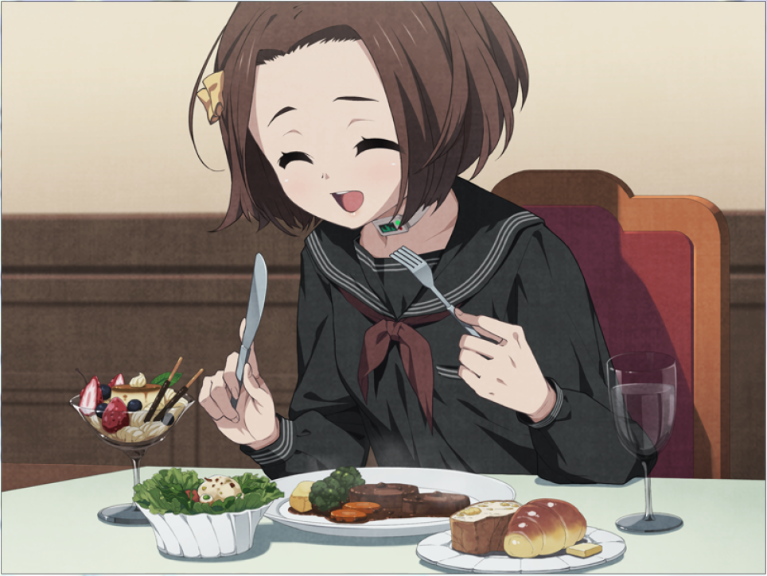

# odin-recipes

This is a simple project from The Odin Project curriculum, more specifically from the HTML Foundations.

Here, our goal is to build a website with different recipes, describing the ingredients and the steps to cook the recipe.

My ideia is to take recipes from animes famous food.

I used the [Anime Recipe](https://animerecipes.tumblr.com/ target="_blank") tumblr to take the recipes and images, so all the credits for them.